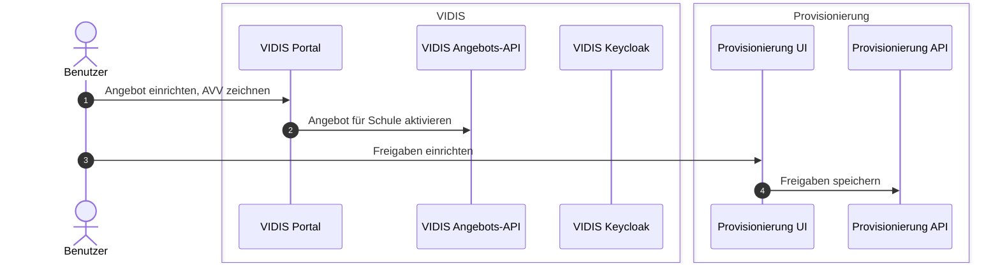
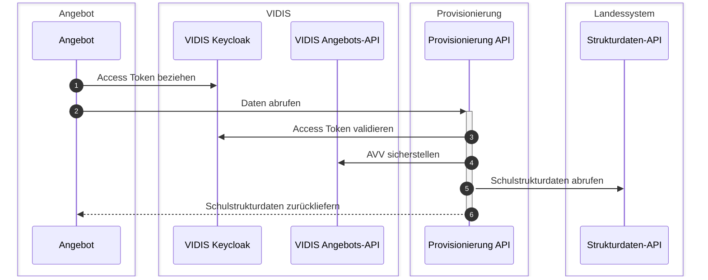

# Architektur

Das Projekt stellt eine API bereit, die Schulstrukturdaten aus verschiedenen Landessystemen verschiedenen Angeboten zur Verfügung stellt.
Die Anbindung der Angebote und die Anbindung der Landessystem sowie das Vereinheitlichen der Daten stehen im Vordergrund.

## Komponentenarchitektur

Das Projekt besteht aus zwei Komponenten:

- UI für das Freischalten einzelner Gruppen oder Schulen für ein Angebot
- API für den Datenabruf durch die Angebote und die Anbindung der Landessysteme

Das Projekt schließt sich an verschiedene Systeme an:

- VIDIS Angebots-API, um sicherzustellen, dass nur Angebote mit vorliegendem AVV Daten abrufen können
- VIDIS Keycloak, um die Authentifizierung der Angebote sicherzustellen und die Authentifizierung der UI zu realisieren
- Landessysteme als Datenquelle
- Angebote als Datenbeziehende

## Prozess Freischalten eines Angebots

## Prozess Datenabruf durch Angebot

